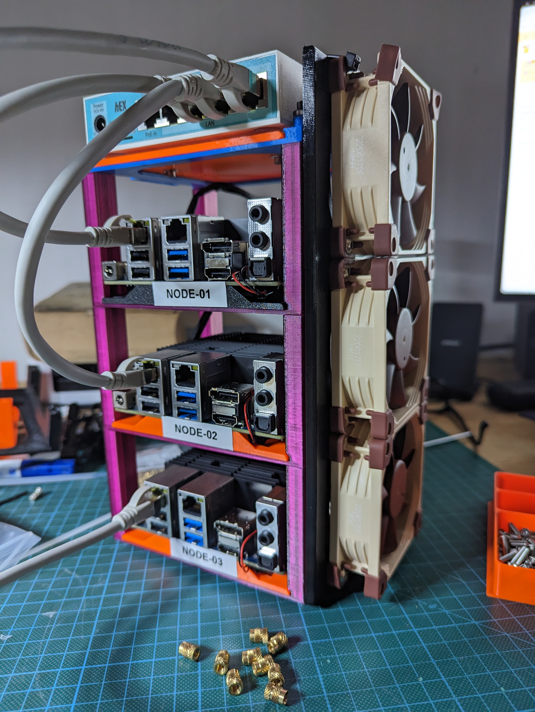

# tinkering-tinkerbell
Tinkering around with [Tinkerbell](https://docs.tinkerbell.org/).
Exploring bare metal k8s cluster provisioning...

I want to learn more about the state of art kubernetes cluster provisoning on bare metal.

At work we use [Gardener](https://gardener.cloud/) to provision k8s clusters on
different providers as GCP, AWS, OpenStack, VMware.

Our companies old legacy, now switched off bare metal cluster was provisioned by
terraform, metallb, matchbox, outdated docker-images and a lot of scripts.

Nowadays there is the shiny [Cluster API](https://cluster-api.sigs.k8s.io/) to
provide the same declarative way to structure and provide nodes and
infrastructure as to k8s clusters itself, you might want to read [Cluster API -
A Guide on How to Get
Started](https://medium.com/condenastengineering/clusterapi-a-guide-on-how-to-get-started-ff9a81262945)
if you are new to that topic.

As far as i see, CAPI focuses on hyperscalers (as also Gardener does). 
I am interested in bare metal hardware provisoning.

Equinix Metal developed [Tinkerbell](https://docs.tinkerbell.org) and opensourced it, i will give it a try.

There are some shortcuts as [K3S](https://k3s.io/), but i want to use a small, container centric os like 
[flatcar](https://www.flatcar.org/), not a fullsize ubuntu.


## Goofing around (fast moving targets - DRAFT)

Tinkerbell bootstraps a single node cluster to run the tinkerbell services on it and work as provisioner for other hardware.

I tried the [sandbox approach with docker
compose](https://github.com/tinkerbell/sandbox/blob/main/docs/quickstarts/COMPOSE.md),
but the machine which i wanted to use as provision server has already too many
services on it which ports are also requested by the tinkerbell services (even
if i bind my services to a dedicated interface, docker tries to bind
0.0.0.0:<port> in many cases).

I was not able to bind all services to other ports in the docker-compose file, i got a k3s cluster but with only a coredns pod running.
I goofed around in the logfiles, but i lost faith and went to another way.

I found in the [CNCF slack,
\#tinkerbell](https://cloud-native.slack.com/archives/C01SRB41GMT/p1672755969841129?thread_ts=1672423115.308059&cid=C01SRB41GMT)
a interesting start point: Using [k3d](https://k3d.io/v5.4.6/) - its a k3s in
docker - to run a local cluster without the k3s loadbalancer:

```bash
k3d cluster
create --network host --no-lb --k3s-arg "--disable=traefik,servicelb" --k3s-arg
"--kube-apiserver-arg=feature-gates=MixedProtocolLBService=true"
--host-pid-mode
```

And then deploy the tinkerbell stuff with helm.
I am on that right now.


## Hardware

### Nodes

I bought three [Hardkernel Odroid
H3](https://www.hardkernel.com/shop/odroid-h3/); this is a x86_64 single board
computer with good specs (pxe booting, 2 network interfaces, changeble RAM and
disk options).

First i aimed for arm64 (also known as Raspberry4, but the 8GB RAM version is
about 180 € right now, if it is in stock somewhere at all, and its not possible
to beef them up later. If Raspi is an option, head over to [Building a
bare-metal Kubernetes Cluster on Raspberry
Pi](https://anthonynsimon.com/blog/kubernetes-cluster-raspberry-pi/)

My Odroids have (right now) 8 GB Ram and 256 GB NVME disk.

I am already familar with the H2, my personal one serves all typical local
things at home, and we used Odroid H2s to build an [18 node bare metal lab
cluster at
work](https://photos.google.com/share/AF1QipPIxF5isLFw8q3Y5bL6p22sNWmxLYC7JQUArTgIg4MjGRWVMu8LyGeXqT3R3Gx_gA?key=Z1ZZc3Z1bnAxakNpbEdfRTFLbk5TWDRBNXRUal93)
to build a test environment for thinks which cannot be tested in kind, minikube
and other virtual envs (like blackout for a complete dc a failing switch,
storage going crazy...)

### Switch / Router

To reduce the blast radius i searched for a little router to separate the home
network from the cluster network.  I opted for a
[MikroTik hEX RB750Gr3](https://mikrotik.com/product/RB750Gr3). Its software
allows a lot of different configurations if neccessary.  I use one port as
uplink into the home network.

My H2 is dual homed, one leg in the home network, the other in the lab network.
On this leg it should act as provisioner for the cluster.

### Cooling

My H2 has a pwm controlled 92mm fan on the top of its case, but it barely uses
it under normal work load.  

I decided to use 80mm [Noctua NF-A8 PWM](https://noctua.at/en/nf-a8-pwm) fans,
suitable to the standard 4pin 2,54mm pitch connector.

The case (see below) is somehow size constrained, so only 80 mm fans are possible.

### Power Supply

The Odroids drain up to 4 Amps with two SATA disks and full cpu load with 15V
DC, the MikroTik is also fine with 15V, so i bought a [ham radio power
supply](https://www.komerci.de/shop/stromversorgung/Festspannungsnetzgeraete/ps30swiv-festspannungsnetzgeraet-13-8v-30a-lcd)
with 15V and 30 Amps max) and some 5.5 mm dc power jacks with open wires and
build a suiable power distribution cable.

### Case 

I printed a case with parts of
[Odroid H2 Rackmount project](https://www.thingiverse.com/thing:3485530) - the H3 
have the same physical specs as their predecessor H2.



I needed to burn a lot of smaller filament remains, so it has really ugly colours :-)
[Here are some more pictures](https://photos.google.com/share/AF1QipOEYq0544IV67harl58_uC0024xNleLqJeiRTEjn7_saC3fTc6Ne1Pnuho2mmJ2EA?key=SUhpWUtIOFYzX0pybnV2RXV3aVNjRk9uWXVsazFR) 

This case design is so genius while it is not only endless stackable but it
has also cages/bays and caddies, the Odroids are mounted to the caddies and
are easy removable from the rack. Thats not the case (sic!) at our company labcluster
case, it is really a mess to change a node, if neccessary!

The switch is just 1mm to big to fit into a cage, thats why it lives on the top
without the vertical columns.

I used 3mm rod to connect the units, the holes are for much bigger rod, so i
printed some spacers and pressed them into the connections between the units
([these blue tubes](https://photos.google.com/share/AF1QipOEYq0544IV67harl58_uC0024xNleLqJeiRTEjn7_saC3fTc6Ne1Pnuho2mmJ2EA/photo/AF1QipOLIP7ZdU2PIErlum0OlAI_0ENNHN7T6_IcpPRl?key=SUhpWUtIOFYzX0pybnV2RXV3aVNjRk9uWXVsazFR).

The fan base is the longest thing i ever printed, it uses the whole printspace
my printer is able to serve (25cm). I melted threaded inserts into it to mount
the fans on it.

