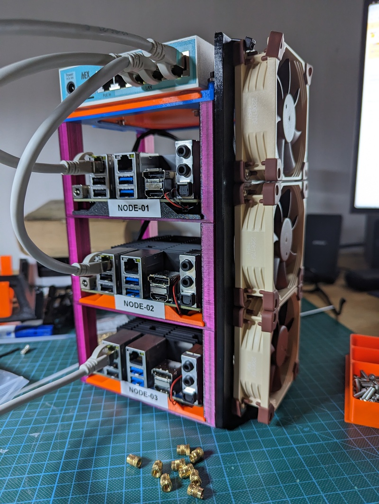
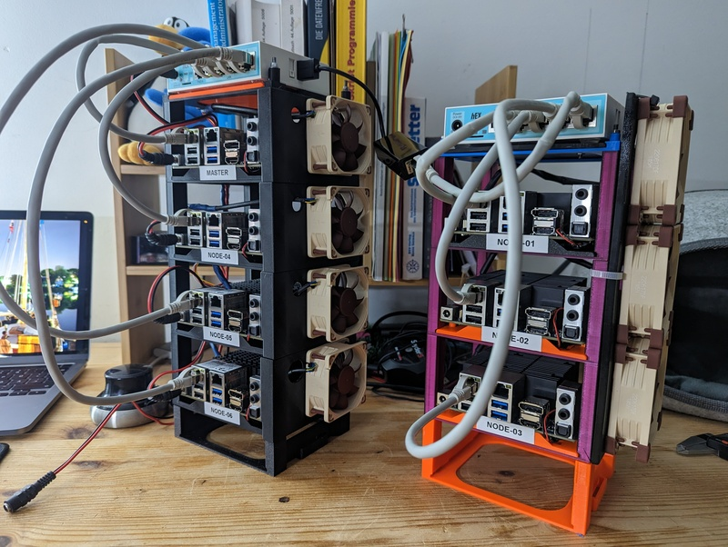

## Hardware

### Nodes

I bought three [Hardkernel Odroid
H3](https://www.hardkernel.com/shop/odroid-h3/); a x86_64 single board computer
with good specs:

* Intel Quad-Core Processor Jasper Lake N5105
* 2x 2.5Gbit ethernet interfaces, (i)pxe booting
* 2x S0-DIMM memory slots (up to 32 GB each)
* multiple disk options (SATA, PCIe M.2 NVMe, eMMC)

First i aimed for arm64 (also known as Raspberry4, but the 8GB RAM version is
at 180 € (january 2023), if it is in stock somewhere, and its not possible
to add more RAM later. If Raspi is an option, you should head over to [Building a
bare-metal Kubernetes Cluster on Raspberry
Pi](https://anthonynsimon.com/blog/kubernetes-cluster-raspberry-pi/) and https://github.com/christianhuening/pinetes/blob/main/README.md.

My Odroids have (right now) 8 GB Ram and 256 GB NVMe disk.

I am already familar with the predecessor [Odroid H2 (similar specs, Celeron
CPU)](https://wiki.odroid.com/odroid-h2/start), my personal one serves all
typical local things at home since years, and we used also Odroid H2s to build
an [18 node bare metal lab cluster at
work](https://photos.google.com/share/AF1QipPIxF5isLFw8q3Y5bL6p22sNWmxLYC7JQUArTgIg4MjGRWVMu8LyGeXqT3R3Gx_gA?key=Z1ZZc3Z1bnAxakNpbEdfRTFLbk5TWDRBNXRUal93)
to build a test environment for things which cannot be tested in kind, minikube
and other virtual envs (like simulated blackout for a complete dc, a failing
switch, storage going crazy...).

### Switch / Router

To reduce the blast radius and protect my home network i searched for a little
router to separate the home network from the lab network.  I opted for a
[MikroTik hEX RB750Gr3](https://mikrotik.com/product/RB750Gr3). MikroTiks routerOS
allows a lot of different configurations if neccessary.  I use one port as
uplink into the home network.

The provisioning node is also an Odroid (H2 type) in the labnet.

### Cooling

My personal H2 has a pwm controlled 92mm fan on the top of its case, but it barely uses
it under normal work load.

The case (see below) is somehow size constrained, so i decided to use 80mm
[Noctua NF-A8 PWM](https://noctua.at/en/nf-a8-pwm) fans, suitable to the
standard 4pin 2,54mm pitch connector.

Later (in february 2023) i got some additional H2 nodes, and i decided to build a
better fitting cooling solution dedicated to each node. I needed a different
connector (4pin 1.25mm pitch) and 5V (instead of 12V as the H3). 

I created a printable fan connector [see below](#case) and opted to use [Noctua
NF-A6x25 5V PWM](https://noctua.at/de/products/fan/nf-a6x25-5v-pwm) fans in it
as 60mm is the regular hight of the rackmount.

### Power Supply

The Odroids drain up to 4 Amps each with two SATA disks and under full cpu load
with 15V DC, the MikroTik is also fine with 15V, so i bought a [ham radio power
supply](https://www.komerci.de/shop/stromversorgung/Festspannungsnetzgeraete/ps30swiv-festspannungsnetzgeraet-13-8v-30a-lcd)
with 15V and 30 Amps max and some 5.5 mm dc power jacks with open wires and
build a suitable power distribution cable.

In real live all loads together consume under 3A, as there is no SATA disk and not
much load at all.

### Case 

I printed a case with parts of
[Odroid H2 Rackmount project](https://www.thingiverse.com/thing:3485530) - the H3 
have the same physical specs as the H2.

An improved version with H2 types and better fan distribution (february 2023) on the left:

I burned down a lot of smaller filament remains, so it has really ugly colours :-)
[Here are some more pictures](https://photos.google.com/share/AF1QipOEYq0544IV67harl58_uC0024xNleLqJeiRTEjn7_saC3fTc6Ne1Pnuho2mmJ2EA?key=SUhpWUtIOFYzX0pybnV2RXV3aVNjRk9uWXVsazFR) 

This case design is genius while it is not only endless stackable but it
has also cages/bays and caddies, the Boards are mounted to the caddies and
are easy removable from the rack. Thats not the case (sic!) at our company labcluster
case, it is really a mess to change a node, if neccessary.

The switch is just 1mm to big to fit into a cage, thats why it lives on the top
without the vertical columns around it.

I used 3mm rod to connect the units, the holes are for much bigger rod, so i
printed some spacers and pressed them into the connections between the units
([these blue tubes](https://photos.google.com/share/AF1QipOEYq0544IV67harl58_uC0024xNleLqJeiRTEjn7_saC3fTc6Ne1Pnuho2mmJ2EA/photo/AF1QipOLIP7ZdU2PIErlum0OlAI_0ENNHN7T6_IcpPRl?key=SUhpWUtIOFYzX0pybnV2RXV3aVNjRk9uWXVsazFR)).

The fan base is the longest thing i ever printed, it uses the whole printspace
my printer is able to serve (25cm). I melted threaded inserts into it to mount
the fans on it.

The whole thing is easy movable if neccessary. A vest pocket cluster.

For the 2nd set (H2 type) i wanted to use dedicated fans for each node, so i
created another [fan connector which fits directly on one hight unit of the rack
mount kit](https://www.thingiverse.com/thing:5867495).

